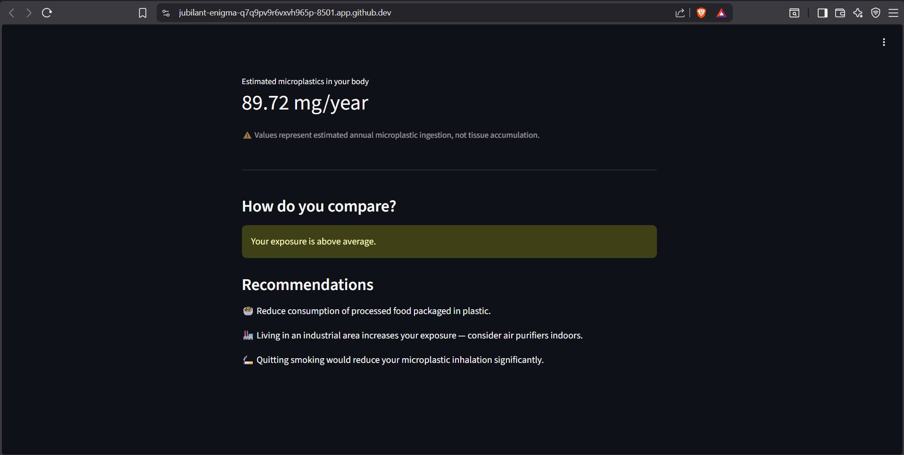

# Microplastic Bioaccumulation Assessment Tool

This appliation has the role to roughly estimate the quantity of microplastics(mg/year), that an individual ingest every year

## Screenshot

## Technologies Used:
-Python
-Streamlit
-scikit-learn
-pandas
-numpy
-joblib 

## How to Run Locally
-`git clone https://github.com/lexaNo1/microplastic-quiz`
-`cd microplastic-quiz`
-`pip install -r requirements.txt`
-`streamlit run app.py`

## Limitations
1. Synthetic dataset - generated on scientific literature, not real clinical data
2. Results represent estimated annual microplastics ingestion, not tissue accumulation
3. Cosmetics scoring based on limited post-microbeads-ban literature
4. Population average (88mg/year) is a temporary estimate, pending validation from peer-reviewed biomonitoring studies
5. Model trained on synthetic data - accuracy may differ on real-world populations 

## Live Demo
[Click here to try the app](https://microplastic-quiz-2ocfdazmjyb57mgctkh42m.streamlit.app/)